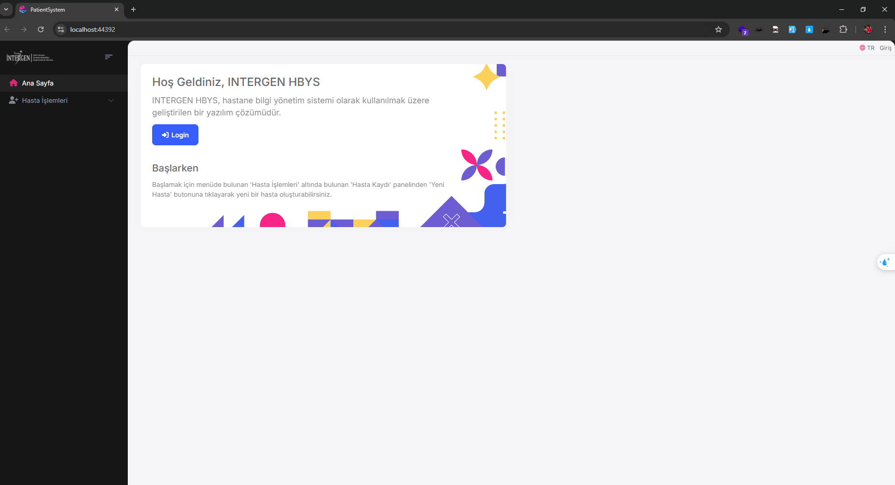
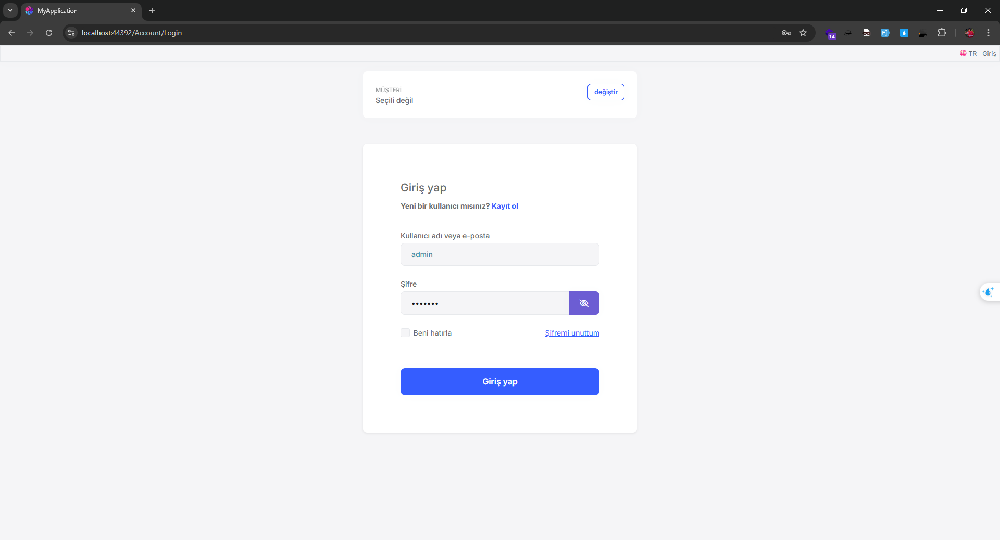
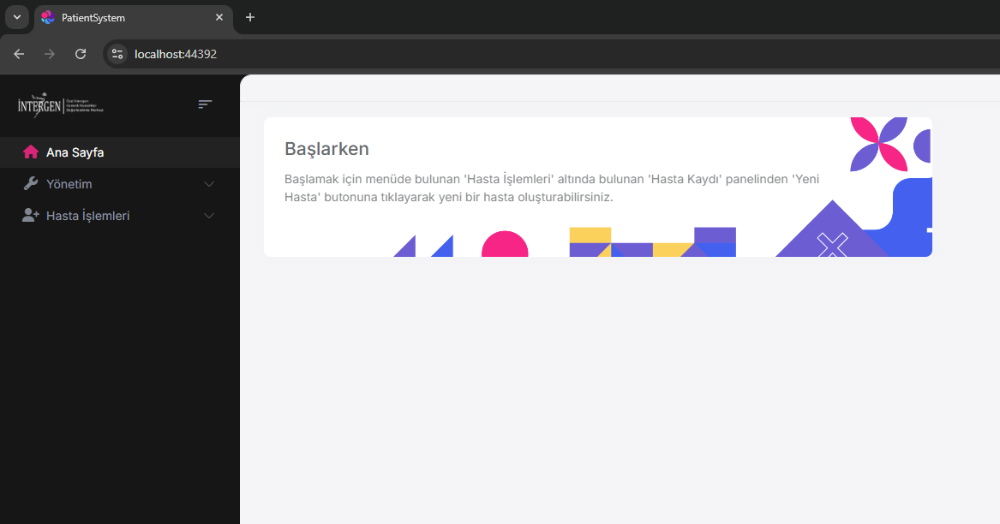
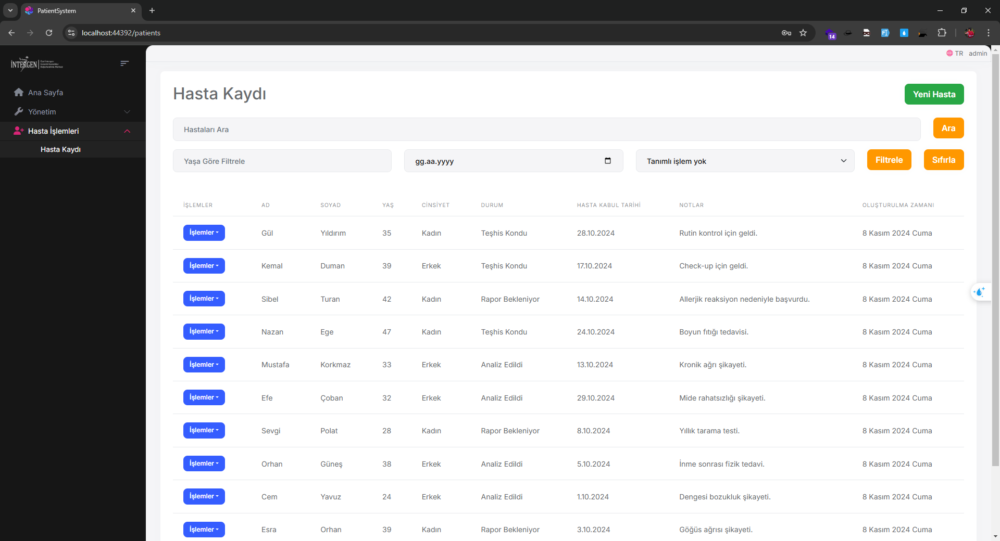
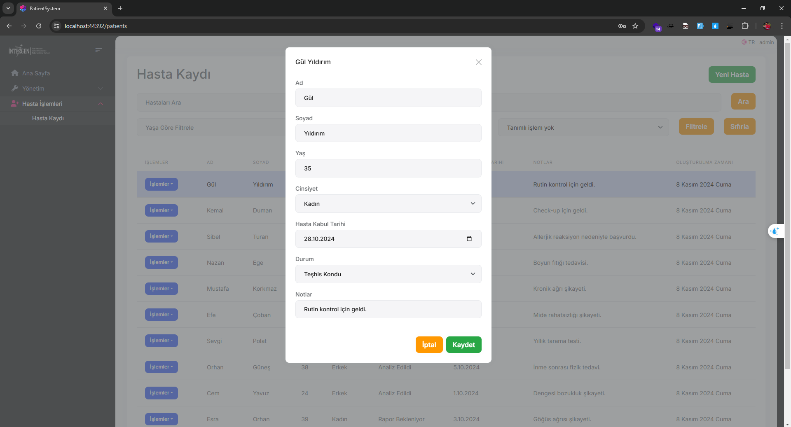

# Hasta Kayıt Yönetim Sistemi

## Genel Bakış

Hasta Yönetim Sistemi, hasta kayıtlarını verimli bir şekilde yönetmek için tasarlanmış bir web uygulamasıdır. Kullanıcıların hasta bilgilerini oluşturmasına, okumasına, güncellemesine ve silmesine, ayrıca hasta kayıtlarını filtrelemesine ve arama yapmasına olanak tanır.

## Özellikler

- **Hasta Kaydı**: Adı, soyadı, yaş, cinsiyet, kabul tarihi, durum ve notlar gibi ayrıntılarla yeni hastalar ekleyin.
- **Arama ve Filtreleme**: Hasta adına göre arama yapın ve yaş, kabul tarihi ve duruma göre filtre uygulayın.
- **Sayfalama**: Hasta kayıtları arasında sayfalama ile gezinin.
- **Düzenleme ve Silme**: Mevcut hasta kayıtlarını güncelleyin veya silin.
- **Responsive Tasarım**: Çeşitli cihazlarda kullanıma uygun kullanıcı dostu arayüz.

## Kullanılan Teknolojiler

- **Frontend**: Blazor Server
- **Backend**: ASP Framework, ASP.NET Core, Entity Framework Core
- **Veritabanı**: SQL Server
- **Yerelleştirme**: JSON dosyaları kullanarak çoklu dil desteği
- **Bağımlılık Enjeksiyonu**: ASP.NET Core tarafından yönetilir
- **Entity Framework Core**: Veritabanı işlemleri için

## Başlarken

### Önkoşullar

- .NET8.0+ SDK
- Node v18 veya 20
- SQL Server

### Kurulum

1. **Depoyu klonlayın**:
    ```bash
    git clone https://github.com/yourusername/hasta-yonetim-sistemi.git
    cd hasta-yonetim-sistemi
    ```

2. **İmzalama ve şifreleme sertifikaları kurulumu**:
    Bir sertifika oluşturmak için aşağıdaki komutu kullanabilirsiniz:
    ```bash
    dotnet dev-certs https -v -ep openiddict.pfx -p b958d0f1-37d8-4ab1-a4ab-f4ec2cf5e97d
    ```

3. **İstemci Tarafı kütüphanelerini yükleyin**:
 ```bash     
    abp install-libs
  ```

4. **Veritabanını ayarlayın**:
    - `appsettings.json`'daki bağlantı dizesini SQL Server örneklerinize güncelleyin.
    - "Server=localhost\\(veritabanbağlantı adı);Database=PatientSystem;Trusted_Connection=True;TrustServerCertificate=true"
    - Veritabanını oluşturmak ve geçişleri uygulamak için aşağıdaki komutu çalıştırın:
      ```bash
      dotnet ef database update --project PatientSystem
      ```
OR Bu depoda bulunan yedek veritabanı .BAK dosyasını kullanabilirsiniz

5. **Uygulamayı çalıştırın**:

### Kullanım

- Web tarayıcınızda `https://localhost:44392/` adresine gidin.
- Hasta kaydı ve yönetim özelliklerine erişmek için menüyü kullanın.

### Ekran Görüntüleri






